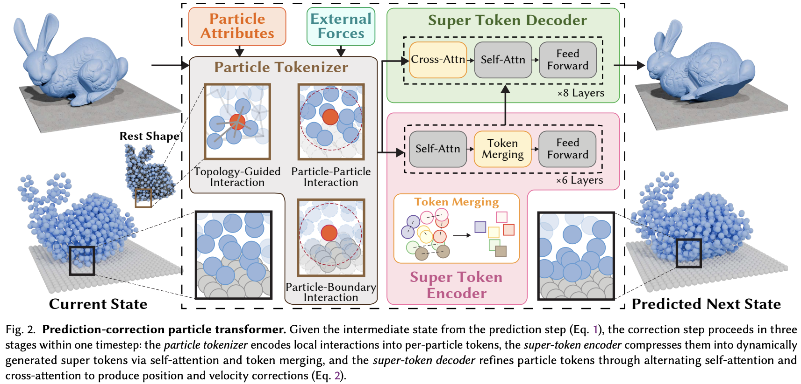

</img>

## WorldParticle (wip)

Implementation of [WorldParticle](https://arxiv.org/abs/2605.15305), Unified Simulation of Lagrangian Particle Dynamics via Transformer

## Install

```bash
$ pip install worldparticle
```

## Usage

```python
import torch
from worldparticle import WorldParticle, ParticleTokenizer

tokenizer = ParticleTokenizer(
    dim = 64,
    dim_attr = 1,
    grid_res = 5,
    spatial_radius = 2.0,
    boundary_radius = 2.0
)

model = WorldParticle(
    predictor = dict(
        delta_time = 0.01
    ),
    corrector = dict(
        dim = 64,
        enc_depth = 4,
        dec_depth = 4,
        enc_dim_head = 96,
        enc_heads = 8,
        dec_dim_head = 96,
        dec_heads = 8
    ),
    tokenizer = tokenizer
)

pos = torch.randn(2, 512, 3)
vel = torch.randn(2, 512, 3)
forces = torch.randn(2, 512, 3)
mass = torch.ones(2, 512)

boundary_pos = torch.randn(2, 128, 3)

# forward 1 step

out = model(
    pos = pos,
    vel = vel,
    mass = mass,
    forces = forces,
    tokenizer_kwargs = dict(
        attrs = mass,
        boundary_pos = boundary_pos
    )
)

# out.pos (2, 512, 3)
# out.vel (2, 512, 3)

# or multi-step rollout

out_trajectory = model(
    num_steps = 10,
    pos = pos,
    vel = vel,
    mass = mass,
    forces = forces,
    return_initial_state = True,
    tokenizer_kwargs = dict(
        attrs = mass,
        boundary_pos = boundary_pos
    )
)

# out_trajectory.pos (2, 11, 512, 3)
# out_trajectory.vel (2, 11, 512, 3)
```

## Citations

```bibtex
@misc{wang2026unifiedsimulationlagrangianparticle,
    title   = {Unified Simulation of Lagrangian Particle Dynamics via Transformer},
    author  = {Caoliwen Wang and Minghao Guo and Siyuan Chen and Heng Zhang and Mengdi Wang and Xingyu Ni and Hanson Sun and Kunyi Wang and Zherong Pan and Kui Wu and Lingjie Liu and Yin Yang and Chenfanfu Jiang and Taku Komura and Wojciech Matusik and Peter Yichen Chen},
    year    = {2026},
    eprint  = {2605.15305},
    archivePrefix = {arXiv},
    primaryClass = {cs.GR},
    url     = {https://arxiv.org/abs/2605.15305},
}
```
